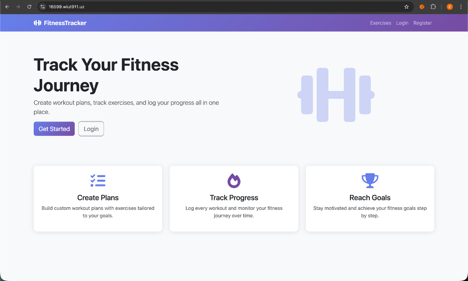
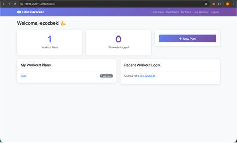
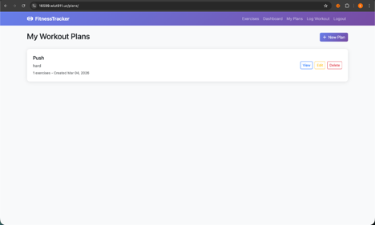
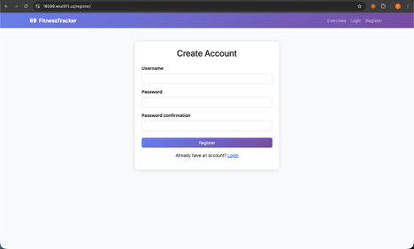
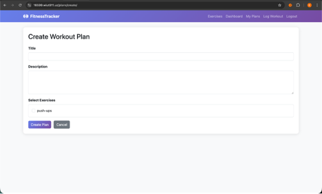

# 🏋️ Fitness Tracker

A full-stack web application for tracking workouts, managing fitness plans, and monitoring progress.

## 📋 Features

- User authentication (register, login, logout)
- Create and manage workout plans
- Browse exercise library
- Log completed workouts
- Admin panel for content management
- Responsive design with Bootstrap 5

## 🛠️ Technologies Used

- **Backend:** Django 4.2, Python 3.11
- **Database:** PostgreSQL 15
- **Web Server:** Nginx
- **Application Server:** Gunicorn
- **Containerization:** Docker, Docker Compose
- **Frontend:** Bootstrap 5, HTML5, CSS3
- **CI/CD:** GitHub Actions
- **Cloud:** Azure VM Server

## 🚀 Local Setup Instructions

### Prerequisites
- Docker Desktop installed
- Git installed

### Steps

1. Clone the repository:
\```bash
git clone https://github.com/YOURUSERNAME/fitness-tracker.git
cd fitness-tracker
\```

2. Create `.env` file:
\```bash
cp .env.example .env
\```

3. Update `.env` with your values (see Environment Variables section below)

4. Build and run with Docker:
\```bash
docker-compose up --build
\```

5. Run migrations:
\```bash
docker-compose exec web python manage.py migrate
\```

6. Create superuser:
\```bash
docker-compose exec web python manage.py createsuperuser
\```

7. Collect static files:
\```bash
docker-compose exec web python manage.py collectstatic --noinput
\```

8. Visit `http://localhost` in your browser

## 🌐 Deployment Instructions

1. SSH into your server
2. Clone the repository
3. Create and configure `.env` file
4. Run with Docker Compose:
\```bash
docker-compose up --build -d
docker-compose exec web python manage.py migrate
docker-compose exec web python manage.py collectstatic --noinput
\```

## ⚙️ Environment Variables

Create a `.env` file in the root directory with these variables:

| Variable | Description | Example |
|----------|-------------|---------|
| `SECRET_KEY` | Django secret key | `your-secret-key` |
| `DEBUG` | Debug mode | `False` |
| `DB_NAME` | Database name | `fitnessdb` |
| `DB_USER` | Database user | `postgres` |
| `DB_PASSWORD` | Database password | `yourpassword` |
| `DB_HOST` | Database host | `db` |
| `DB_PORT` | Database port | `5432` |
| `ALLOWED_HOSTS` | Allowed hosts | `localhost,127.0.0.1` |

## 📸 Screenshots

### Home Page


### Dashboard


### Workout Plans


### Register Page


### Adding Workout Plans


## 👤 Test Credentials

- **URL:** https://16599.wiut911.uz/ 
- **Username:** ezozbek
- **Password:** 12345

## 📄 License
MIT License
